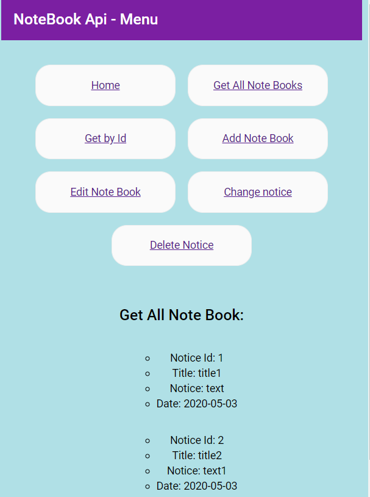

# modol8-notatnik
Napisz Notatnik online – aplikacje z interfejsem graficznym, 
która umożliwia na tworzenie notatek, zapisywanie 
ich w bazie danych, późniejszą edycję, oraz wyświetlanie.

Gui - Angular

##
Technologies:
*Hibernate,
*DataBase: H2,
*Angular,
*Spring Boot,
*Java: 1.8

