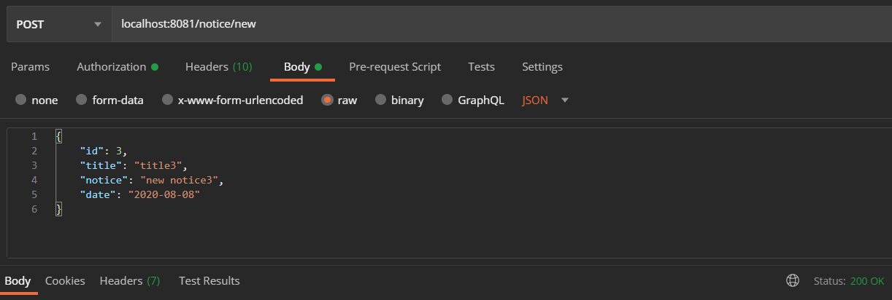
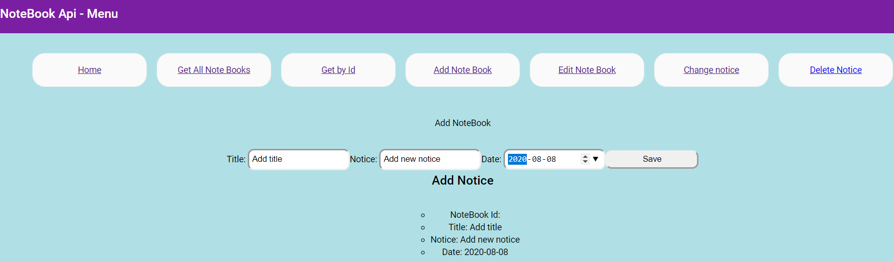
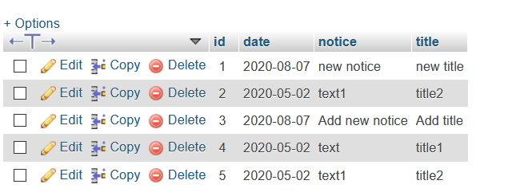
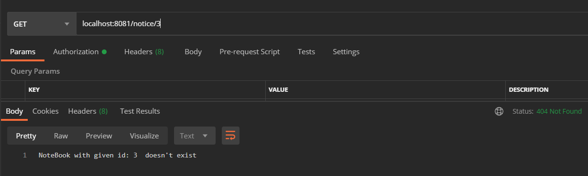

# NoteBook - modol8-notatnik
Napisz Notatnik online – aplikacje z interfejsem graficznym, 
która umożliwia na tworzenie notatek, zapisywanie 
ich w bazie danych, późniejszą edycję, oraz wyświetlanie.

GUI - Angular
PLase use port 8081

##
Technologies:
*Java: 1.8,
*Spring Boot,
*JPA & Hibernate,
*DataBase: remoteMySQL, H2,
*Angular: angular part please see: https://github.com/Iwona007/modol8-notatnik-angular

img: postman add new notice:

img: angular add new notice:

img: view in remote MySql

img: postman advice for not fund exception: 404

